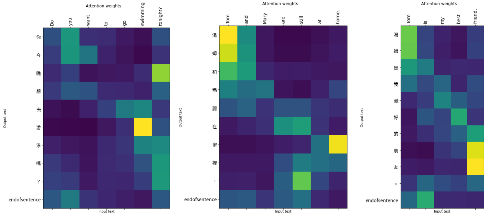
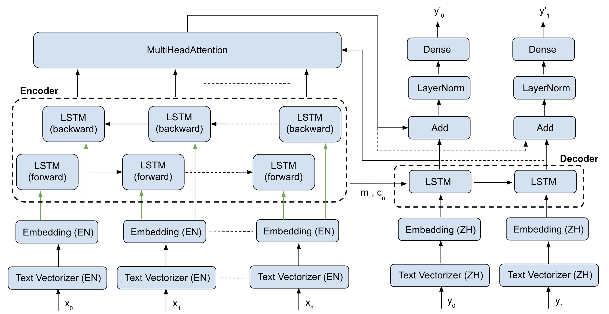

# English Chinese Translation with Attention-based Sequence-to-Sequence Model

Helps beginners to crack into neural machine translation (NMT) with Tensorflow functional API

## Motivation
Despite the rich resources on this topic, most of them are based on the official Tensorflow tutorial and share very similar setup, namely, to build an NMT model with subclassing API to translate Spanish to English.  

Although subclassing API is extremely flexible, **it can be intimidating for beginners, hard for debugging and reduces the readability provided by Keras**. In fact, even for someone who has experience in Tensorflow, when I first started to implement NMT with attention, I had a really hard time to follow the tutorials out there. Moreover, Spanish and English belong to the same language family (i.e. the Indo-European family) and limited open work has experimented this model architecture across different language family.

I believe a more **beginner friendly** implementation has its value, hence, we will be using the functional API to ensure readability. In addition, to examine this model architecture on languages from different family would be interesting, so we will work with English and Chinese, two vastly different languages.

## Overview of this project
- Objective: Demonstrate how to build and train an attention based seq to seq model in Tensorflow  
- Use case: Translate English to Chinese 
- Dataset: English and Chinese pair from Anki
- Model: Attention based encoder decoder model (based on Mr. Aurélien Geron's NMT implementation with modifications to the attention layer used) 

## How to run?
This whole notebook was developed in Colab with GPU accelerated runtime, so the easiest way is to run this notebook in Colab.

Alternatively, you can also clone this project and run locally, however, make sure you have all the packages (such as Tensorflow, matplotlib, numpy, Opencc) installed.

If you are just interested to see the model performance, you can load up the trained model in the model folder. The script is shown in section 3.1.
